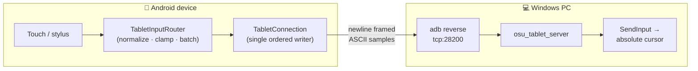

<div align="center">

# osu! Tablet Driver

**Turn your Android device into a low-latency drawing tablet for your PC.**

Draw in art apps or aim in [osu!](https://osu.ppy.sh/) — your phone or tablet becomes an absolute pointing device over a plain USB cable.

[](https://www.android.com/)
[](https://kotlinlang.org/)
[-brightgreen)](https://developer.android.com/tools/releases/platforms)
[](#)
[](#-wire-protocol)

**Companion PC server → [osu_tablet_server](https://github.com/Dranov220805/osu_tablet_server)**

</div>

---

## Overview

`osu_tablet_driver` is the Android half of a two-part system that maps a
rectangular **active area** on your device's screen to your PC monitor,
*absolutely* — the same physical spot on the glass always lands on the same
pixel, exactly like a graphics tablet. Touches are streamed to a lightweight
[server](https://github.com/Dranov220805/osu_tablet_server) running on your PC,
which reproduces them as native mouse input.

No Wi-Fi, no cloud, no pairing. Just a USB cable and ADB's reverse tunnel.

## Why absolute mapping?

A regular touchscreen or trackpad is *relative* — you swipe, the cursor drifts.
Aiming games and digital art need *absolute* input, where screen position maps
directly to a fixed point. That is the entire reason drawing tablets exist, and
it is what this app gives you from hardware you already own.

## Features

- 🎯 **Absolute area mapping** — define a custom active rectangle; it maps 1:1 to your monitor.
- ✍️ **Stylus aware** — pressure, tilt, hover, barrel button and eraser are all reported when your device supports them.
- 📐 **Precise calibration** — drag the on-screen area or type exact millimetre dimensions.
- 🪶 **Low latency** — `TCP_NODELAY`, unbuffered touch dispatch and per-frame batching keep the path short.
- 🔁 **Auto-reconnect** — unplug and replug the cable; the link heals itself with no button pressing.
- 💾 **Rotation-safe** — the active area is stored proportionally, so it survives orientation and resolution changes.
- 🔌 **USB only** — traffic never leaves the cable.

## How it works



1. The app captures every pointer sample and normalizes it to `0..1` inside your active area.
2. Samples are streamed over TCP to `localhost:28200`, tunnelled to the PC by `adb reverse`.
3. The [server](https://github.com/Dranov220805/osu_tablet_server) maps them onto the monitor and injects native mouse input.

## Requirements

| | |
|---|---|
| **Device** | Android 8.0 (API 26) or newer |
| **PC** | Windows with the [companion server](https://github.com/Dranov220805/osu_tablet_server) |
| **Cable** | USB data cable (not charge-only) |
| **Developer setting** | **USB debugging** enabled |

## Getting started

### 1. Enable USB debugging

1. **Settings → About phone** → tap **Build number** seven times to unlock Developer Options.
2. **Settings → Developer options** → enable **USB debugging**.

### 2. Install the app

**Prebuilt APK** — grab `apks/OsuTabletDriver.apk` from this repo and install it (allow "install from unknown sources" if prompted).

**Or build from source** — see [Building](#building-from-source).

### 3. Run the server

Download and launch [osu_tablet_server](https://github.com/Dranov220805/osu_tablet_server) on your PC.

### 4. Connect

Plug the device into your PC. Accept the **"Allow USB debugging?"** prompt on the
device (tick *Always allow* to skip it next time). Open the app — it connects
automatically and the status changes to **Connected**.

## Usage

### Calibrating the active area

Tap the ✏️ floating button to enter **setup mode**:

- **Drag** the rectangle to move it; **drag a corner handle** to resize.
- Or type exact **Width / Height in millimetres** and tap **Apply Dimensions**.
- **Save and Exit** to persist, or **Cancel** to discard.

In play mode, only touches **inside** the rectangle drive the cursor — the rest
of the screen is dead space, so you can rest your palm.

### Touch handling

Every case a real tablet driver has to get right is handled explicitly:

| Case | Behaviour |
|---|---|
| Drag outside the active area | Clamped to the border; the stroke continues instead of freezing |
| Release outside the area | `UP` is still sent, so a button can never stick on the PC |
| System gesture steals the touch | `CANCEL` is sent; the PC releases every held button |
| App sent to background mid-stroke | Same as cancel, issued from `onPause` |
| Second finger during a stroke | Ignored — one pointer owns the cursor for the whole stroke |
| Batched samples (`getHistorical*`) | Replayed in order, preserving digitizer resolution |
| Stylus hover | Reported as `HOVER` / `OUT_OF_RANGE`, so you can aim before touching |
| Stylus pressure & tilt | Sent with every sample |
| Barrel button / eraser tip | Mapped to secondary / tertiary buttons |
| Rotation or resolution change | Area is stored proportionally and rescales |

## 🔌 Wire protocol

Version 2 — newline-terminated ASCII over `adb reverse` on TCP **28200**.

The server greets with `OSUTABLET/2 <hostname>`; the client replies `V2` and
then streams one line per sample:

```
<phase> <x> <y> <pressure> <buttons> <tool> <tiltX> <tiltY>
```

| Field | Meaning |
|---|---|
| `phase` | `D` down · `M` move · `U` up · `H` hover · `X` out-of-range |
| `x` `y` | integers over `0..10000` (normalized to the active area) |
| `pressure` | integer over `0..1000` |
| `buttons` | bitmask (primary / secondary / tertiary) |
| `tool` | finger · stylus · eraser · mouse |
| `tiltX` `tiltY` | signed degrees |

Two bare control messages carry no payload: `C` (cancel — release everything)
and `K` (keepalive). **Version 1 clients and servers still interoperate.** Full
definition in [`net/Protocol.kt`](app/src/main/java/com/example/osutablet/net/Protocol.kt).

## Building from source

```bash
git clone https://github.com/Dranov220805/osu_tablet_driver.git
cd osu_tablet_driver
./gradlew assembleDebug
# → app/build/outputs/apk/debug/app-debug.apk
```

Or open the project in **Android Studio** and run it onto a connected device.
Requires JDK 17+ (Android Studio's bundled JBR works) and the Android SDK for API 36.

## Project structure

```
app/src/main/java/com/example/osutablet/
├── MainActivity.kt          # UI, lifecycle, touch routing
├── EditableAreaView.kt      # the active-area overlay & setup gestures
├── TabletAreaStore.kt       # proportional persistence of the area
├── input/
│   ├── PointerSample.kt     # one immutable normalized sample + wire encoding
│   └── TabletInputRouter.kt # raw MotionEvents → tablet samples
└── net/
    ├── Protocol.kt          # wire-format constants
    └── TabletConnection.kt  # socket, ordered writer, reconnect
```

## Troubleshooting

| Symptom | Fix |
|---|---|
| Stuck on **Connecting** / **Server not running** | Start the PC server; confirm the device shows under `adb devices`. |
| **"Allow USB debugging?"** never appears | Use a data cable, re-plug, and check Developer Options is on. |
| Cursor moves outside the drawn area | Fixed in v2.0 — make sure you're on the latest build. |
| Nothing happens after replugging | v2.0 auto-reconnects; on older builds, tap **Retry Connection**. |

## Related projects

- 🖥️ **[osu_tablet_server](https://github.com/Dranov220805/osu_tablet_server)** — the required PC-side companion.

## License

No license has been declared yet. Until one is added, default copyright applies
and reuse rights are reserved by the author. If you intend this to be open
source, consider adding a `LICENSE` file (e.g. MIT).

## Acknowledgments

- [Android Developer docs — USB debugging](https://developer.android.com/studio/debug/dev-options)
- [ADB reverse tunnelling](https://developer.android.com/tools/adb)

---

<div align="center">
<sub>Contributions and issues welcome.</sub>
</div>
